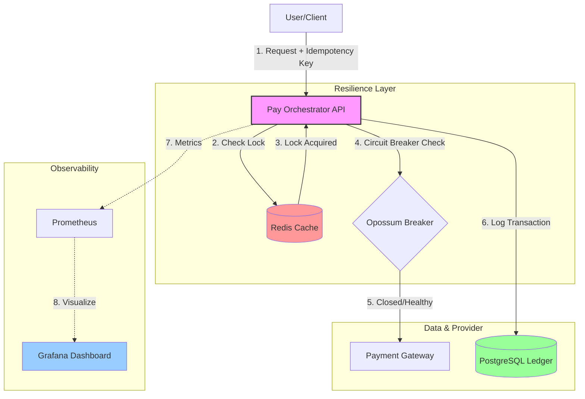

# Resilient-Pay-Orchestrator

A production-grade, containerized financial middleware designed to eliminate double-charges and survive downstream gateway failures through advanced event-driven patterns.

## 🚀 The Mission
In financial systems, a "Gateway Timeout" is an ambiguous state. Did the payment fail, or is it simply slow? This orchestrator eliminates that ambiguity by providing a **Resilience Layer** that protects the ledger and ensures transactional integrity even during total provider outages.

## 🏗️ System Architecture


### 1. Idempotency Guard (Redis)
* **The Problem**: Network retries often lead to double-charging customers.
* **The Solution**: Requests are validated against a Redis-backed idempotency registry using a unique `idempotency_key`.
* **Result**: Duplicate requests are blocked before reaching the payment gateway.

### 2. Multi-Stage Docker Environment
* **The Problem**: Large production images and slow hot-reloading on Windows host machines.
* **The Solution**: A 4-stage `Dockerfile` (Base, Development, Builder, Production).
* **Result**: Production images are hardened and minimal (~150MB), while the Dev stage uses **Chokidar Polling** to ensure instant restarts on Windows/NTFS systems.

### 3. Persistence & Observability (PostgreSQL & Grafana)
* **Data Integrity**: PostgreSQL serves as the source of truth for the transaction ledger.
* **Observability-as-Code**: Dashboards and Prometheus data sources are fully **provisioned via YAML**, ensuring the monitoring stack is restored automatically on every `docker-compose up`.

## 📊 Full-Stack Observability
The project is fully instrumented with **Prometheus** and **Grafana** to provide a "Single Pane of Glass" into system health.

* **Latency Heatmap**: Visualizes the distribution of database and gateway response times, allowing for the identification of P99 tail-latencies.
* **Error Breakdown**: A real-time categorization of traffic (200 Success vs. 425 Idempotency Block vs. 500 Gateway Error).
* **Resource Monitoring**: Tracks Node.js event loop lag and active socket handles to detect memory leaks or thread pool exhaustion.

## 🛠️ Infrastructure as Code (IaC)
Infrastructure is managed via **Terraform**, ensuring that the PostgreSQL RDS instance, Redis ElastiCache, and ECS clusters are provisioned with consistent, secure configurations across environments.

## 🚦 Local Development

### Prerequisites
* **Docker Desktop**: Required for container orchestration.
* **Node.js 20+**: (Optional) For local linting or running scripts outside of Docker.

### Getting Started
1. **Clone & Setup**:
    ```bash
    git clone [https://github.com/Jorge22f/resilient-pay-orchestrator.git](https://github.com/Jorge22f/resilient-pay-orchestrator.git)
    cd resilient-pay-orchestrator
    cp .env.example .env
    ```
2.  **Launch the Stack**:
    ```bash
    docker-compose up -d --build
    ```
3.  **Hot-Reloading (Windows/WSL2)**:\
The development container utilizes Chokidar Polling to ensure file changes on the Windows host are instantly reflected in the Linux container environment.
4.  **Access Points**:
    * **App API**: `http://localhost:8080`
    * **Prometheus**: `http://localhost:9090`
    * **Grafana**: `http://localhost:3001` (Login: admin/admin)

## 🧪 Simulation Scenarios

### 1. The Success Path
* **Test**: Run `npm run test:load` with a healthy gateway.
* **Observation**: The **Success Rate** gauge in Grafana holds at 100%, and the **Latency Heatmap** shows stable P50/P99 response times.

### 2. Idempotency Conflict
* **Test**: Trigger two identical requests with the same `x-idempotency-key` simultaneously.
* **Observation**: The first request succeeds; the second is immediately rejected with a `425 Too Early`. The **Error Breakdown** pie chart reflects the surge in 4xx traffic without increasing DB write load.

### 3. Circuit Breaker & Recovery
* **Test**: Simulate a downstream gateway failure (e.g., forcing 500 errors).
* **Observation**: After reaching the failure threshold, the **Circuit Breaker** trips to the **Open** state.
* **Self-Healing**: Once the gateway recovers, the breaker enters a **Half-Open** state, allowing a trial percentage of traffic through before fully closing and restoring service.

### 4. Stress Load & DB Latency
* **Test**: Increase concurrent users to 50+ during a load test.
* **Observation**: Use the **Latency Heatmap** to identify potential bottlenecks in the PostgreSQL ledger, helping to validate indexing strategies.

## 📜 License
Distributed under the MIT License. See `LICENSE` for more information.